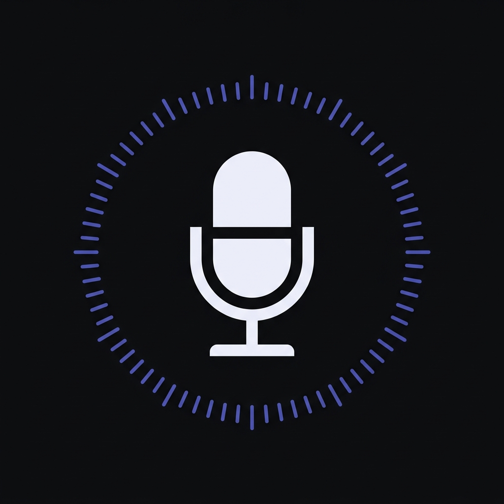

<div align="center">



# Tara — Voice AI Coding Assistant

**Talk to your codebase. Claude Code executes. Tara speaks back.**

[](https://code.visualstudio.com/)
[](LICENSE)
[](https://ai.google.dev/)
[](https://www.anthropic.com/)

</div>

---

Tara is a **VS Code extension** that replaces typing prompts with speaking them. Hold the orb, describe what you want built, and Claude Code executes it in your workspace while Tara reads back the result — all without leaving your editor.

> **Workspace-level, not desktop-level.** Tara lives inside VS Code and operates on your current project. It is separate from desktop-level AI orchestrators.

---

## ✨ Features

| Feature | Description |
|---|---|
| 🎙 **Push-to-talk voice input** | Hold the orb (or `Ctrl+Shift+Space`) to speak a command |
| 🌐 **Animated voice orb** | Real-time circular EQ visualizer driven by your mic's frequency data |
| 🤖 **Claude Code integration** | Streams execution output live into the chat panel |
| 🗣 **Gemini Live TTS** | Tara speaks back — task summaries, clarifying questions, warnings |
| 📋 **Kanban task board** | Track all running agents with live elapsed time + cost estimates |
| ⚠️ **Risk confirmation** | Destructive commands (delete, drop, force push) require confirmation |
| ⏹ **Voice interrupt** | Stop any agent mid-task from voice or the UI |
| 💰 **Live cost display** | Running token count + USD estimate per agent and total session |
| 🎨 **Premium dark UI** | Solid-color design system with film grain texture, no gradients |

---

## 🏗 Architecture

```
[You speak]
    → Mic captured in Webview (getUserMedia)
    → base64 PCM chunks → Extension Host
    → GeminiVoiceBridge (WebSocket → Gemini 2.0 Flash Live)
    → STT transcript → executeCommand()
    → AgentOrchestrator → ClaudeCodeRunner (child_process)
    → claude --print --output-format stream-json
    → stdout streamed line-by-line → Chat Panel
    → On done: VS Code notification + Gemini TTS summary
    → Kanban board updated throughout
```

**Stack:**
- **Extension host** — TypeScript, VS Code Extension API
- **Webview UI** — React + Vite (bundled into `media/`)
- **Voice STT/TTS** — Gemini 2.0 Flash Live API (WebSocket)
- **AI Execution** — Claude Code CLI (`@anthropic-ai/claude-code`)
- **Styling** — Vanilla CSS with SVG noise grain texture

---

## 🚀 Getting Started

### Prerequisites

```bash
# 1. Install Claude Code CLI
npm install -g @anthropic-ai/claude-code

# 2. Authenticate Claude
claude auth

# Verify it works
claude --version
```

You will also need a **Gemini API key** (free tier available):
→ [aistudio.google.com/app/apikey](https://aistudio.google.com/app/apikey)

### Install the Extension

**Option A — From VSIX (recommended)**

1. Download `tara-vscode-x.x.x.vsix` from [Releases](https://github.com/webdevarif/tara-voice-claude/releases)
2. Open VS Code → `Ctrl+Shift+X` → `⋯` → **Install from VSIX...**
3. Select the downloaded file → Reload VS Code

**Option B — From source**

```bash
git clone https://github.com/webdevarif/tara-voice-claude.git
cd tara-voice-claude

# Install all dependencies
npm run install:all

# Build extension + webview
npm run build

# Open in VS Code and press F5
code .
```

### First-Time Setup

Open VS Code Settings (`Ctrl+,`) and configure:

| Setting | Description |
|---|---|
| `tara.geminiApiKey` | Your Gemini API key for voice STT/TTS |
| `tara.claudeCodePath` | Path to `claude` binary (default: `claude` in PATH) |
| `tara.maxConcurrentAgents` | Max parallel Claude agents (default: `3`) |
| `tara.riskConfirmation` | Confirm before destructive commands (default: `true`) |

---

## 🎮 Usage

1. Click the **🎙 Tara** icon in the VS Code activity bar
2. **Hold the orb** to speak — release to send
3. Watch Claude Code stream output into the chat
4. Check the **Kanban panel** for agent status and cost

### Keyboard Shortcuts

| Shortcut | Action |
|---|---|
| `Ctrl+Shift+Space` | Hold to speak (push-to-talk) |
| `Ctrl+Shift+.` | Stop current agent |

### Example Voice Commands

```
"Add input validation to the user registration form"
"Write unit tests for the auth module"
"Refactor the database connection to use a connection pool"
"Find all TODO comments and create GitHub issues for each"
"Add TypeScript types to the entire utils folder"
```

---

## 📁 Project Structure

```
tara-vscode/
├── src/
│   ├── extension.ts              ← Extension entry point
│   ├── types.ts                  ← Shared types, risk patterns, pricing
│   ├── execution/
│   │   └── AgentOrchestrator.ts  ← Claude Code process manager (multi-agent)
│   ├── voice/
│   │   └── GeminiVoiceBridge.ts  ← Gemini Live WebSocket (STT + TTS)
│   └── panels/
│       ├── ChatPanelProvider.ts  ← Chat webview + message routing
│       └── KanbanPanelProvider.ts← Kanban board webview
├── webview-ui/                   ← React + Vite UI
│   └── src/
│       ├── App.tsx               ← Chat interface
│       ├── KanbanApp.tsx         ← Kanban board
│       ├── App.css               ← Design system (solid colors + grain)
│       └── components/
│           ├── VoiceOrb.tsx      ← Animated circular EQ visualizer
│           ├── ChatBubble.tsx    ← Message bubbles with code rendering
│           ├── StatusIndicator.tsx
│           └── ConfirmDialog.tsx ← Risk command confirmation
└── media/
    ├── tara-icon.png
    └── tara-sidebar-icon.svg
```

---

## 🔒 Security & Privacy

- Voice audio is sent directly to the **Gemini Live API** (Google) — not stored by Tara
- Code execution happens via the **Claude Code CLI** running locally in your workspace
- No code or conversation data is sent to any Tara servers — there are none
- API keys are stored in VS Code's settings (use the Secret Storage API for production use)

---

## 🗺 Roadmap

- [ ] **Graph memory** — SQLite per-project knowledge graph; inject only relevant context into Claude sessions instead of full codebase
- [ ] **Multi-task orchestration** — Gemini parses your request and splits into parallel sub-agents (backend / UI / tests)
- [ ] **Wake-word** — "Hey Tara" using Porcupine WASM (offline, no cloud)
- [ ] **Voice interrupt** — Say "stop" mid-task to halt a running agent
- [ ] **Noor integration** — Optional daily summary push to Noor desktop orchestrator
- [ ] **Session replay** — Review past voice sessions with transcripts and diffs

---

## 🤝 Contributing

Contributions are welcome! Please:

1. Fork the repo
2. Create a feature branch: `git checkout -b feature/my-feature`
3. Commit your changes: `git commit -m 'Add my feature'`
4. Push and open a PR

Please open an issue first for major changes so we can discuss the approach.

---

## 📄 License

[MIT](LICENSE) © 2026 [webdevarif](https://github.com/webdevarif)

---

<div align="center">
  <sub>Built with ❤️ — Voice-first coding, finally.</sub>
</div>
